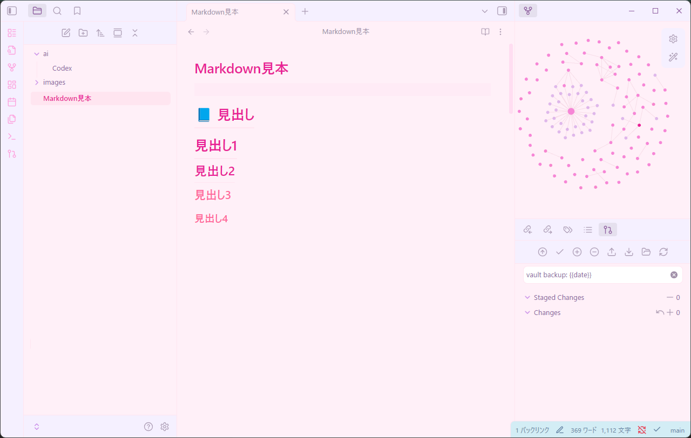

# 🌸 パステルゆめかわテーマ for Obsidian 💕（Pastel Yumekawa Theme for Obsidian）

パステル系でかわいくてゆめかわなObsidianテーマです。視認性を保ちながら、夢見がちで可愛らしい色合いでノートを書けます。

## ✨ 特徴

- 🌸 **パステルカラー**: 淡いラベンダーとピンクを基調とした優しい配色
- 💕 **ゆめかわデザイン**: 夢見がちで可愛らしい印象の配色
- 👀 **視認性重視**: 長時間のノート作成でも目に優しく、文字の視認性を最大限担保
- 🎨 **統一感のある配色**: すべてのUI要素が調和した色合い
- ✨ **夢見がちな雰囲気**: 高明度・低彩度でソフトなグラデーションを多用した雰囲気

## 📥 インストール方法

### Obsidian Community Themesからインストール（推奨）

1. Obsidianを開く
2. 設定（⚙️アイコン）を開く
3. 「外観」タブを選択
4. ベーステーマで「ライト」を選択
5. 「テーマ」セクションで「ブラウズ」をクリック
6. 検索バーに「**Pastel Yumekawa**」と入力
7. 「インストール」をクリック
8. インストール後、テーマ一覧から「Pastel-Yumekawa」を選択

### 手動インストール

1. リポジトリをクローンまたはダウンロード
2. `Pastel-Yumekawa` フォルダを `.obsidian/themes/` にコピー
3. Obsidianを再起動
4. 設定 → 外観 → テーマから「Pastel-Yumekawa」を選択
5. ベーステーマで「ライト」を選択

## 🎨 カラーパレット

| 要素 | カラーコード | 説明 |
|------|------------|------|
| メイン背景 | `#FFF0F8` | 淡いピンク |
| サブ背景 | `#F5F0FF` | 淡いラベンダー |
| アクセント | `#E91E96` | 鮮やかなピンク |
| テキスト | `#8B5A9D` | 落ち着いた紫 |
| リンク | `#C88AE8` | 優しいラベンダー |
| コード | `#00A896` | ティールグリーン |
| カーソル | `#FF8FD6` | 明るいピンク |

## 💡 推奨設定

より美しく表示するために、以下の設定を推奨します：

- **フォント**: Noto Sans JP、Meiryo、游ゴシックなど日本語に対応したフォント
- **フォントサイズ**: 16px〜18px
- **行の高さ**: 1.8〜2.0

設定は、Obsidianの設定 → 外観 から変更できます。

## 📸 スクリーンショット

## 🤝 貢献

バグ報告や機能要望は、GitHubのIssuesでお知らせください。プルリクエストも歓迎します！

## 📝 ライセンス

このテーマは [MIT License](LICENSE) の下で公開されています。

## 🙏 クレジット

このテーマは、パステルカラーとゆめかわなデザインを愛するみなさまのために作成されました。

---

**Enjoy your dreamy note-taking experience! 💕**
